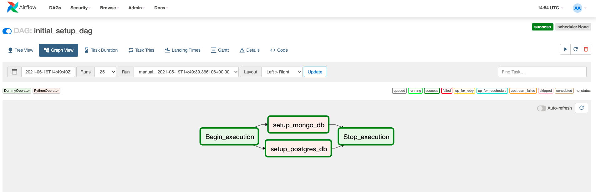

# etl-pipeline

## Introduction
Initial project setup for loading data from various source into Postgres Database. 
The data pipeline performs ELT operation, that is it first loads the data into STAGE TABLE in target from there 
required Dimension and Facts table are loaded after running Data validation rules. 


## Getting started


### Project structure explanation
```
etl-pipeline
│   README.md                            # Project description
│   docker-compose.yml                   # Airflow containers description   
│   requirements.txt                     # Python dependencies
│
└───data                                 # Sample data provided  
|   | events.json                        # Events sample data        
|   | organization.json                  # Orgainzation sample data
│   
└───airflow                              # Airflow home
|   |               
│   └───dags
│   |   │ data_pipeline_template_dag.py  # DAG definition                        
│   |   │ initial_data_load_dag.py       # DAG definition
|   |   |
|   └───plugins
│       │  
|       └───helpers
|       |   | sql_queries.py             # All sql queries needed
|       |
|       └───operators
|       |   | initial_setup.py           # Setting up target and source DB
```
#### Requirements

* Install [Python3](https://www.python.org/downloads/)
* Install [Docker](https://www.docker.com/)
* Install [Docker Compose](https://docs.docker.com/compose/install/)

#### Clone repository to local machine
```
git clone https://github.com/ajaykammardi/etl-pipeline.git
```

#### Change directory to local repository
```
cd etl-pipeline
```

#### Create python virtual environment
```
python3 -m venv venv             # create virtualenv
source venv/bin/activate         # activate virtualenv
pip install -r requirements.txt  # install requirements
```

#### Start Airflow container
Everything is configured in the docker-compose.yml file.
If you are satisfied with the default configurations you can just start the containers.
```
docker-compose up -d
```

#### Visit the Airflow UI
Go to http://localhost:8080
```
Username: airflow 
Password: airflow
```

#### Start the Pipeline

---
**NOTE:** 
Initally all the DAG would be in OFF state, Start the DAG by switching it state from OFF to ON.
---
#### Step 1: Initial Setup DAG (One Time JOB)
Click on the initial_data_load_dag to view the current state and click on Trigger DAG.

Pipeline would setup target DB (Postgres) and Source DB (MongoDB). It would create all the initial tables and load initial data.


#### Step 2: ETL Pipeline


#### Cleaning up
To Stop and delete containers, delete volumes with database data and download images, run:
```
docker-compose down --volumes --rmi all
```

---
**NOTE** 
* Couldn't complete task and Additional Challenge due to time constraint, basic idea is to setup DAGs for loading data and performing Data validations hence providing the initial framework.
---