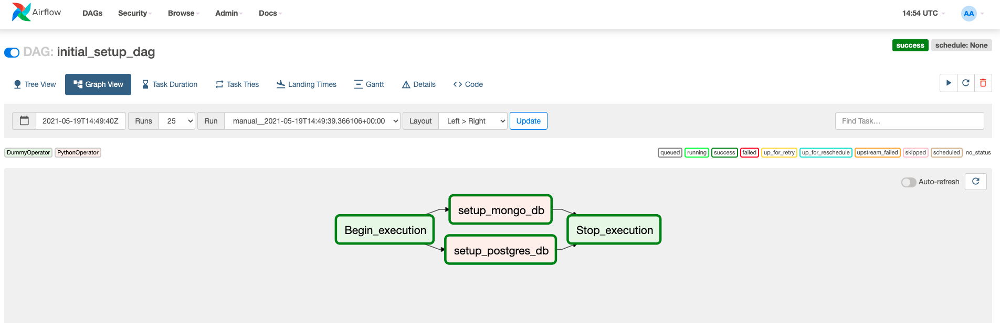
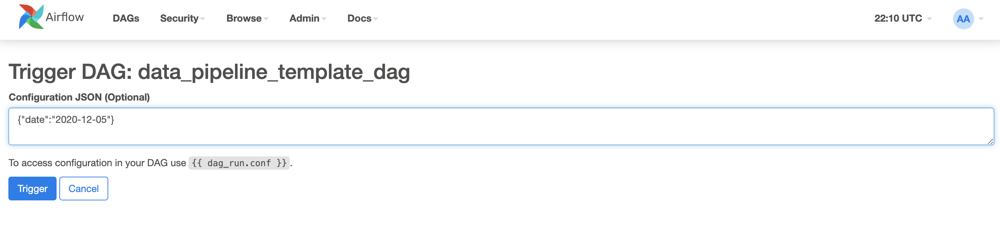
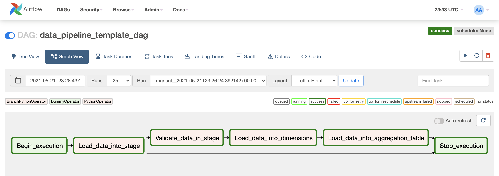
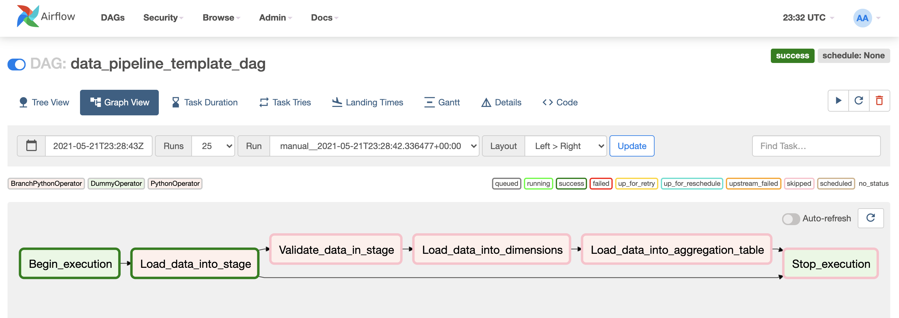

# etl-pipeline

## Introduction
Initial project setup for loading data from various source into Postgres Database. 
The data pipeline performs ELT operation, it first loads the data into STAGE TABLE in target from there 
required Dimension and Facts table are loaded after running Data validation rules. 


## Getting started


### Project structure explanation
```
etl-pipeline
│   README.md                                   # Project description
│   docker-compose.yml                          # Airflow, Postgres and MongoDB containers description 
│   Dockerfile                                  # Airflow docker file with pymongo installation   
│   requirements.txt                            # Python dependencies
│
└───data                                        # Sample data provided  
|   | events.json                               # Events sample data        
|   | organization.json                         # Orgainzation sample data
│   
└───airflow                                     # Airflow home
|   |               
│   └───dags
│   |   │ data_pipeline_template_dag.py         # DAG definition                        
│   |   │ initial_data_load_dag.py              # DAG definition
|   |   |
|   └───plugins
│       │  
|       └───config                              # Config folder
|       |   | runtime.cnf                       # Config file
|       | 
|       └───helpers
|       |   | sql_queries.py                    # All sql queries needed
|       |
|       └───operators
|       |   | aggregation_table_load.py         # Loading up aggregate table
|       |   | data_validation.py                # Data quality checks
|       |   | dimension_load.py                 # Loading up dimension tables
|       |   | initial_setup.py                  # Setting up target and source DB
|       |   | load_data_source_to_stage.py      # Data Extraction from source to stage

```
### Requirements

* Install [Python3](https://www.python.org/downloads/)
* Install [Docker](https://www.docker.com/)
* Install [Docker Compose](https://docs.docker.com/compose/install/)

### Clone repository to local machine
```
git clone https://github.com/ajaykammardi/etl-pipeline.git
```

### Change directory to local repository
```
cd etl-pipeline
```

### Create python virtual environment
```
python3 -m venv venv             # create virtualenv
source venv/bin/activate         # activate virtualenv
pip install -r requirements.txt  # install requirements
```

### Start Airflow container
Everything is configured in the docker-compose.yml file.
If you are satisfied with the default configurations you can just start the containers.
```
docker-compose up -d
```

### Visit the Airflow UI
Go to http://localhost:8080
```
Username: airflow 
Password: airflow
```

### Start the Pipeline

---
**NOTE:** 
Initally all the DAG would be in OFF state, Start the DAG by switching it state from OFF to ON.
---
### Step 1: Initial Setup DAG (One Time JOB)
Click on the `initial_data_load_dag` to view the current state and click on Trigger(Play button) DAG.

Pipeline would setup target DB (Postgres) and Source DB (MongoDB). It will create all the initial tables and initial data.
`dim_organization` postgres table and `events` mongo collection will get loaded after successful completion.  



### Step 2: ETL Pipeline
Click on the `data_pipeline_template_dag` to view the current state and click on Trigger(Play button) DAG.

Pipeline expects a `date` input parameter, on click of Trigger DAG pass the `date` parameter for which the data to be loaded.

```
Input format - {"date":"YYYY-MM-DD"}
```



Pipeline will trigger further steps if data found in source collection for given input date.



#### Pipeline stages
* `Begin_execution` - Dummy operator does nothing, but a flag to mark start of pipeline.
* `Load_data_into_stage` - Loads the data if present into `staging_events` postgres table from `events` mongo collection for given input date.
* `Validate_data_in_stage` - Runs data quality rules on the stage data and marks unqualified records.
* `Load_data_into_dimensions` - Loads below tables from `staging_events`
    * `dim_user` - User belonging to organization dimension in SCD type 2.
    * `user_events` - Events corresponding to user.
    
* `Load_data_into_aggregation_table` - Loads a report table `org_user_report`, which contains number of user created/updated/deleted for a given day across organization.
* `Stop_execution` - Dummy operator does nothing, but a flag to mark end of pipeline.

If No data found in source collection for given input date pipeline would terminate after `Load_data_into_stage` step




### Cleaning up
To Stop and delete containers, delete volumes with database data and download images, run:
```
docker-compose down --volumes --rmi all
```

---
**NOTE :** 
Couldn't Additional Challenge due to time constraint
---